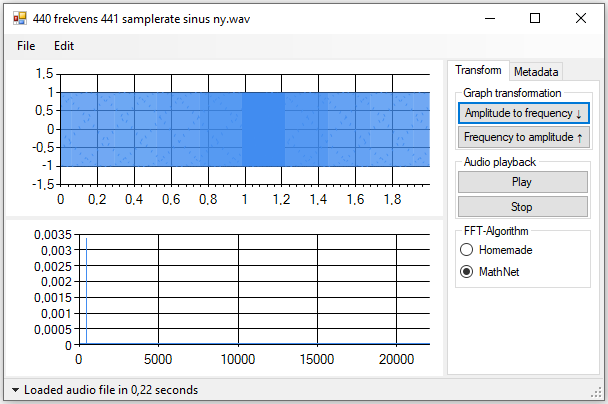
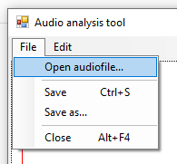
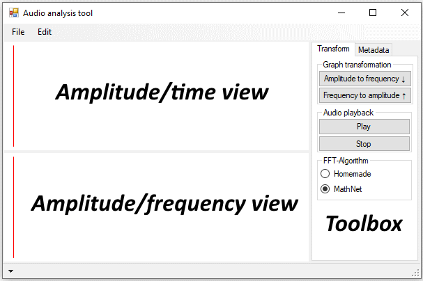
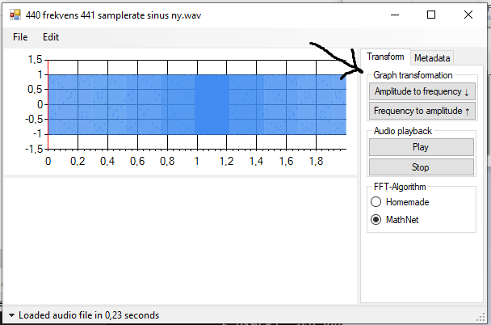
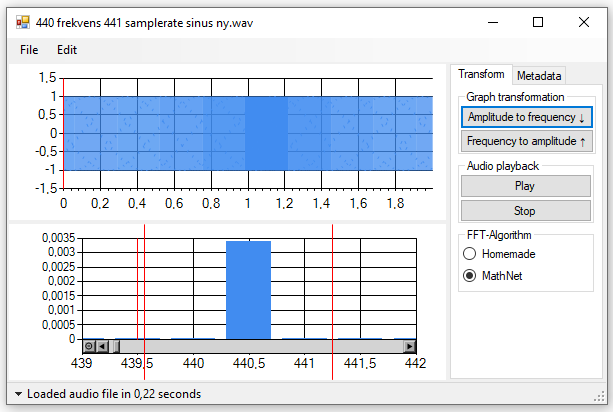

# AudioAnalyzer
View and edit audio files in both frequency- and volume-domain. The project both includes the user-interface and a custom implementation of the Cooley-Tukey written in F#.

## Background
This project was originally developed as the primary focus of my school project [krestenlaust/Fourier-transformation](https://github.com/krestenlaust/Fourier-transformation). When the project ended, I split the original repository into two separate repositories (the other being [krestenlaust/Aud.IO](https://github.com/krestenlaust/Aud.IO)), preserving the commit history. The aftermath of the transformation, is that some of the original commits has nonsensical descriptions, in the context of this repository. Feel free to ignore them.

Because the project originally was an assignment, I've created a report to go alongside it. You can find the report in the original repository (Fourier-transformation).

## Usage
The application has a handful of features, which you can use to
 - visualize the fourier transformation of a given piece of sound.
 - modify fourier transformation of the sound.
 - convert modified fourier transformation back into amplitude/time.

### Navigation

Use the toolbar for filehandling

On the left is the wavelet and frequency bins illustrated using, respectively, a line chart and a bar chart.
On the right, there's a toolbox with various actions you can perform.

Dragging across either of the charts using the left mouse button allows you to zoom. There's a small circle button next to the horizontal scrollbar, which you can press to reset the zoom.

### Actions

The image shows what button you need to press to generate fourier transformation of a loaded audio file. Right below that button, there another button to convert the frequency domain into time domain again, overriding the originally loaded audio sample.

Dragging across the a graph using right click allows you to use the custom selection functionality. When a selection has been made, you can use `Edit->Remove selection` or simply `Del`-key, to remove the selected area.
When using right click-drag you can also select what part of a graph to convert. Just select it, and press the corresponding convert button.

## Contributing
Feel free to contribute however you like, any input/issue is welcome. If I don't respond at first, try tagging me as well.
